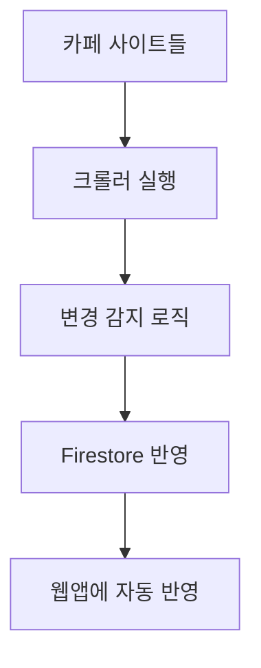

# ☕ Specialty Coffee 원두 자동 동기화 시스템

## 🧠 목적
각 커피 브랜드(카페) 사이트를 주기적으로 크롤링하여:

- 새 원두는 자동 등록
- 품절/삭제된 원두는 자동 비활성화 처리
- 가격, 향미 등의 변경은 자동 업데이트
- 결과는 웹앱(원두 구매 페이지)에 자동 반영 (Firebase Firestore)

## 🧩 시스템 구조


## 🧱 데이터 구조 (Firestore 기준)
기존 beans 컬렉션의 구조를 확장:

```json
{
  "name": "Ethiopia Benti Korbo",
  "brand": "센터커피",
  "origin": "Ethiopia",
  "price": 23000,
  "flavors": ["Fruity", "Bergamot"],
  "processing": "Anaerobic Natural",
  "roast_level": "Medium Light",
  "weight_g": 200,
  "imageUrl": "https://...",
  "buyUrl": "https://...",
  "desc": "산뜻한 베르가못과 꽃향이 특징인 에티오피아 원두",
  "lastUpdated": "2023-05-26T14:00:00Z",
  "createdAt": "2023-05-20T10:00:00Z",
  "isActive": true,
  "inStock": true,
  "source": {
    "crawlerId": "centercoffee",
    "originalId": "product-12345",
    "lastCrawled": "2023-05-26T14:00:00Z"
  }
}
```

## 🔁 동기화 로직
기존 DB와 크롤링 결과를 비교:

- **신규 원두**: DB에 없고 크롤링에는 있음 → `add()`
- **삭제된 원두**: DB에 있고 크롤링에는 없음 → `isActive: false` 처리
- **수정된 원두**: price/flavor 등 변경 시 → `update()`
- **복원된 원두**: 비활성화되었던 원두가 다시 등장 → `isActive: true` 처리

## ⚙️ 크롤링 대상 관리 (config 기반)

```python
CRAWLERS = {
  "centercoffee": {
    "label": "센터커피",
    "type": "shopify_rss",
    "url": "https://centercoffee.co.kr/collections/all.atom",
    "schedule": "0 0 * * 1"  # 매주 월요일 자정
  },
  "fritz": {
    "label": "프릳츠커피",
    "type": "html",
    "url": "https://fritz.co.kr/shop/beans",
    "schedule": "0 0 1 * *"  # 매월 1일 자정
  }
}
```

## 📋 구현 체크리스트

### 1. 기본 인프라 구성 (`commit: init-crawler-structure`)
- [ ] 프로젝트 디렉토리 구조 생성
- [ ] 의존성 정의 (requirements.txt)
- [ ] 설정 파일 템플릿 생성
- [ ] Firebase 연결 모듈 구현

### 2. 크롤러 핵심 구현 (`commit: implement-core-crawlers`)
- [ ] 크롤러 기본 클래스 정의
- [ ] Shopify RSS 크롤러 구현
- [ ] HTML 파싱 크롤러 구현
- [ ] 테스트 데이터 수집 검증

### 3. 데이터 처리 파이프라인 (`commit: data-processing-pipeline`)
- [ ] 원두 데이터 정규화 로직
- [ ] 중복 검사 알고리즘 구현
- [ ] 변경 감지 로직 구현
- [ ] 기존 beans 컬렉션과 매핑

### 4. Firestore 연동 (`commit: firestore-integration`)
- [ ] 신규 원두 추가 함수
- [ ] 원두 업데이트 함수
- [ ] 원두 비활성화 함수
- [ ] 일괄 처리 트랜잭션 구현

### 5. 자동화 설정 (`commit: automation-setup`)
- [ ] CLI 인터페이스 구현
- [ ] 로깅 시스템 구축
- [ ] GitHub Actions 워크플로우 파일 생성
- [ ] 스케줄링 설정

### 6. 테스트 및 모니터링 (`commit: testing-monitoring`)
- [ ] 단위 테스트 작성
- [ ] 통합 테스트 작성
- [ ] 오류 처리 및 알림 시스템
- [ ] 성능 모니터링 도구 추가

### 7. 문서화 및 배포 (`commit: documentation-deployment`)
- [ ] README 파일 작성
- [ ] 설정 및 사용법 문서화
- [ ] 첫 번째 릴리스 버전 태그 지정
- [ ] 운영 환경 배포

## 📅 GitHub 커밋 및 릴리스 계획

### 초기 개발 단계
1. **설계 및 준비** (1일)
   - 요구사항 분석 및 구조 설계
   - `commit: initial-design-docs`

2. **기본 구조 구축** (2일)
   - 프로젝트 기본 구조 생성
   - Firebase 연결 설정
   - `commit: init-crawler-structure`

3. **단일 크롤러 구현** (2-3일)
   - 한 개 카페(센터커피) 크롤러 완성
   - 데이터 추출 및 정규화 테스트
   - `commit: first-crawler-implementation`

4. **데이터 처리 파이프라인** (3-4일)
   - 변경 감지 로직 구현
   - Firestore 연동 기본 기능
   - `commit: data-processing-pipeline`

5. **추가 크롤러 확장** (2-3일)
   - 두 번째 카페(프릳츠) 크롤러 구현
   - 크롤러 공통 코드 리팩토링
   - `commit: additional-crawlers`

### 최적화 및 안정화 단계
6. **테스트 및 버그 수정** (2-3일)
   - 오류 처리 개선
   - 엔드투엔드 테스트
   - `commit: testing-and-bugfixes`

7. **자동화 설정** (1-2일)
   - GitHub Actions 설정
   - 스케줄링 구현
   - `commit: automation-setup`

8. **문서화 및 첫 릴리스** (1일)
   - 사용법 문서 작성
   - v1.0.0 태그 생성
   - `commit: v1.0.0-release`

## 🔄 실행 주기 및 모니터링

### 스케줄링
- **센터커피**: 매주 월요일 자정 (`0 0 * * 1`)
- **프릳츠**: 매월 1일 자정 (`0 0 1 * *`)
- **수동 실행**: 필요시 GitHub Actions에서 수동 트리거

### 모니터링
- **실행 로그**: GitHub Actions 로그에서 확인
- **오류 알림**: 슬랙 또는 이메일로 자동 알림
- **상태 대시보드**: Firestore 기반 간단한 대시보드 구현 (향후)

## 🔒 주의사항
- robots.txt 및 각 사이트 이용약관 준수
- 과도한 요청 방지를 위한 적절한 딜레이 설정
- 이미지는 직접 저장하여 Firebase Storage에 업로드
- 크롤링 실패 시 자동 재시도 로직 구현

## 📝 향후 확장 계획
- **OCR 통합**: 원두 패키지 사진 분석 기능 추가
- **더 많은 카페**: 추가 로스터리 지원
- **AI 향미 분석**: LLM을 활용한 향미 태그 자동 분석
- **가격 변동 추적**: 시간에 따른 가격 변화 그래프 제공

